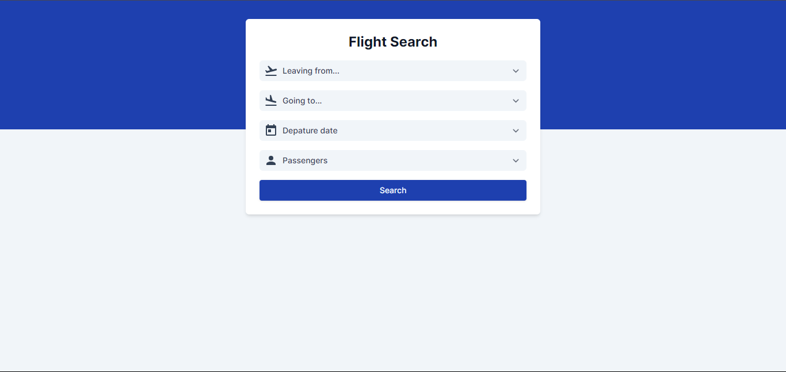
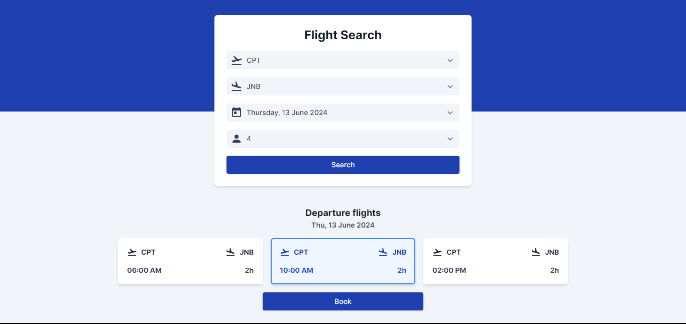
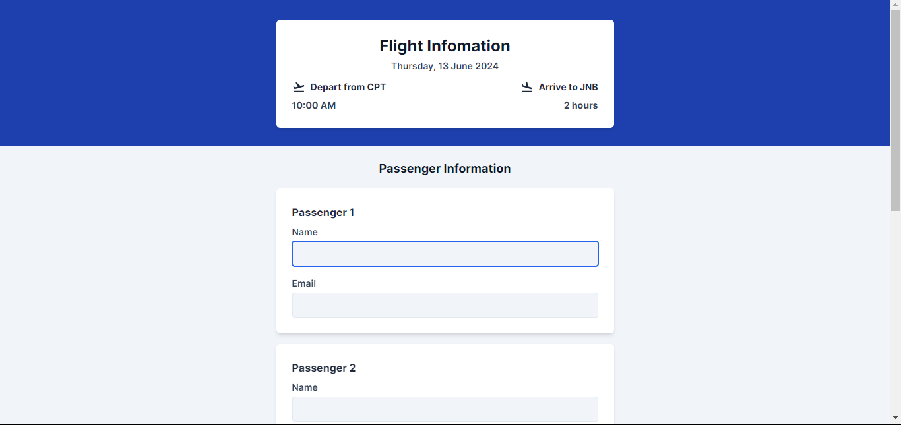
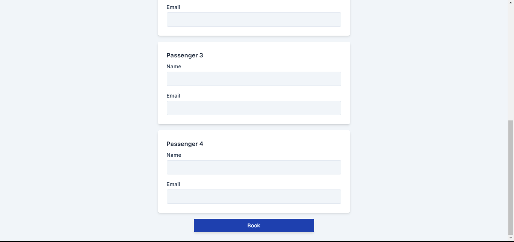
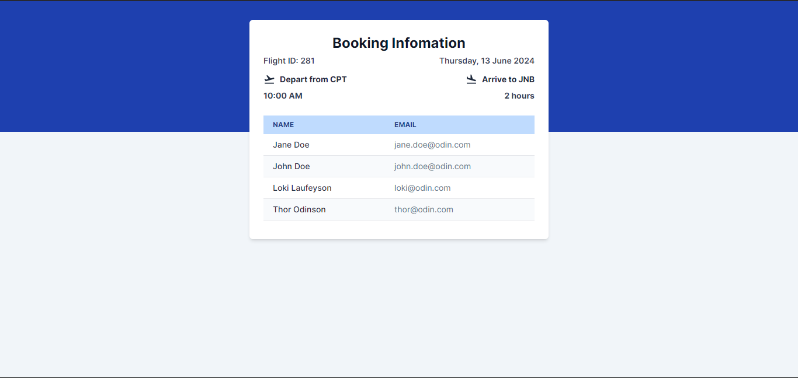
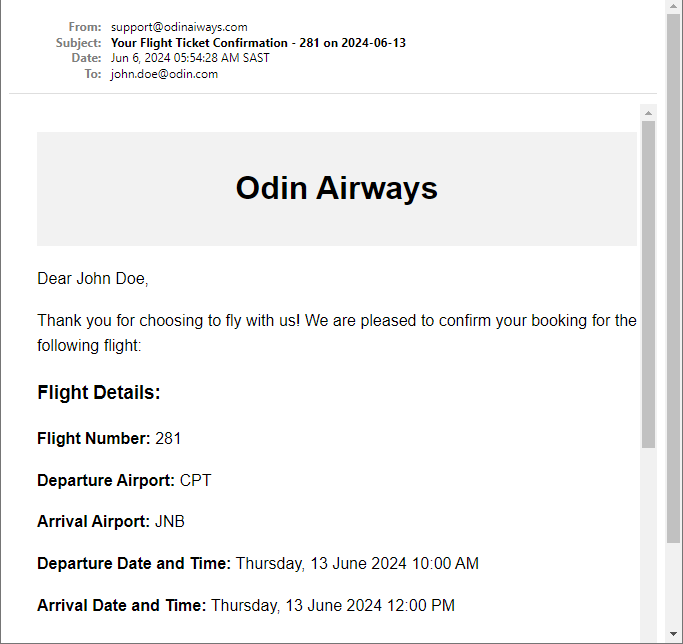
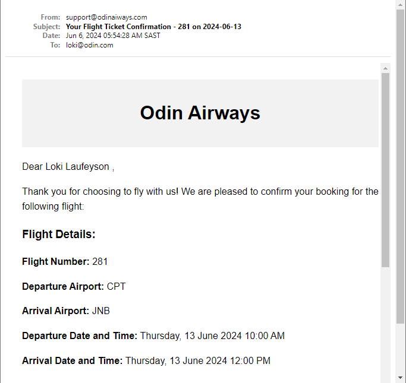
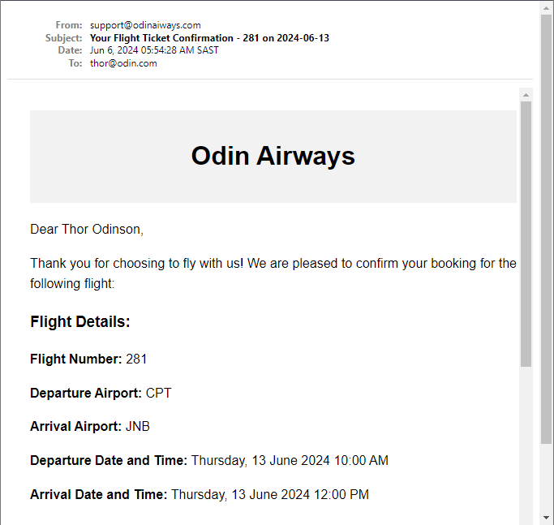

# odin-flight-booker

This is part of the Forms Project in The Odin Project’s Ruby on Rails Curriculum. Find it at <https://www.theodinproject.com/lessons/ruby-on-rails-flight-booker>

## Screeshots

### Flight Search Form

### Flight Results

### Flight Booking

### Booking Information

### Passenger Mailer

